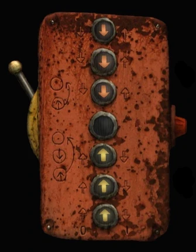

# Machinarium Magnet Arrow Puzzle

Simple recursive solution for magnet arrow puzzle of [Machinarium](https://amanita-design.net/games/machinarium.html
) game.

The puzzle is described in [Machinarium Wiki](https://machinarium.fandom.com/wiki/Docks_Hoist_Puzzle).

My solution is written in Python, it is simple thanks to the recursion technique and works for **any number of arrows**.

## Solution Overview

* The algorithm runs in two stages.
* The first stage (`oppositor` function in code) arrange the arrows in pairs of opposites arrows:
    * input:  >>...>0<...<<
    * output: ><><...><0

* The second stage (`mover` function in code) gets the final configuration.
    * input:  ><><...><0
    * output: <<...<0>...>>
* Panel is represented by two list of arrows, one for the arrows above the hole and another for arrows below.
